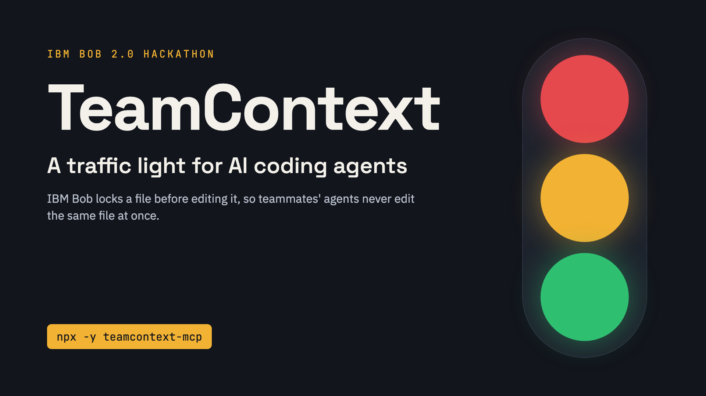

# TeamContext



**A traffic light for AI coding agents.** TeamContext stops two developers' AI agents from editing the same file at the same time. Before IBM Bob edits a file, it claims a lock. If a teammate's agent already holds that file, Bob stops and says who has it and since when.

Built for the **IBM Bob 2.0 Hackathon** (lablab.ai × IBM) by Eswin Poroj and Christian Villegas.

| | |
|---|---|
| **Live dashboard** | https://team-context-omega.vercel.app |
| **MCP server on npm** | [`teamcontext-mcp`](https://www.npmjs.com/package/teamcontext-mcp) |
| **Demo repository** | [Chrivill02/teamcontext-demo](https://github.com/Chrivill02/teamcontext-demo) |
| **Video** | [TODO: video link] |

## The problem

Every developer on the team now codes with their own AI agent, and those agents don't know what the others are doing. Ask your agent to add a search box to the header while a teammate's agent adds a dark-mode toggle to the same header: both edit `src/header.js`, and the team only finds out at merge time. The result is merge conflicts, rework and time lost catching up on what the other agent changed.

## How it works

```
 Bob (custom mode "🚦 TeamContext")
   │  calls MCP tools on its own: team_status → file_lock → edit → file_unlock → release_all
   ▼
 teamcontext-mcp (local MCP server over stdio, one per developer, run with npx)
   │  HTTPS + team token
   ▼
 Central server — Express on Vercel, data in Supabase Postgres
   │
   ▼
 Live dashboard — who is editing what, conflicts avoided, handoff notes
```

1. **Bob custom mode and rules (`bob/`)**: Bob checks team status at the start of a task, locks each file before editing it, unlocks it with a one-line summary, and calls `release_all` with a handoff note before its final answer. The developer never mentions locks.
2. **MCP server (`mcp-server/`, published as `teamcontext-mcp`)**: exposes `team_status`, `file_lock`, `file_unlock` and `release_all`. It detects the repo from `git`, normalizes paths so every teammate refers to the same file, and never crashes if the server is unreachable.
3. **Central server (`server/`)**: a REST API for locks and activity. Lock acquisition is a single Postgres function running in one transaction, so two agents can never hold the same file. Locks expire after a TTL, so a crashed session never blocks the team.
4. **Dashboard (`server/public/`)**: a static page that polls every 4 seconds and holds no secrets.

When a file is taken, the second agent receives:

```
⚠️ CONFLICT: eswin-demo has been editing src/header.js since <ISO timestamp>. Do not edit this file.
```

It stops, tells its developer, and offers options: work on other files, wait and retry, or coordinate with the teammate.

## Try it in 3 steps

You need Node.js 20 or newer, IBM Bob, and a TeamContext server (yours, see [Run your own server](#run-your-own-server)).

1. **Connect the MCP server.** Copy [`bob/mcp.example.json`](bob/mcp.example.json) to `.bob/mcp.json` in your project (it is gitignored) and fill in `CENTRAL_SERVER_URL`, `TEAM_TOKEN`, a unique `DEVELOPER_ID` and `REPO_ROOT`. Bob runs the server with `npx -y teamcontext-mcp`; there is nothing to clone. Details: [mcp-server/README.md](mcp-server/README.md).
2. **Install the mode.** Copy [`bob/custom_modes.yaml`](bob/custom_modes.yaml) and [`bob/rules-teamcontext/`](bob/rules-teamcontext/) into your project's `.bob/` folder.
3. **Work as usual.** Select the **🚦 TeamContext** mode in Bob and ask for a feature. Bob locks, edits, unlocks and leaves a handoff note on its own; watch it on the dashboard.

Every teammate must use the same repository (same `origin` remote) so file paths match.

## Run your own server

1. Create a Vercel project with **Root Directory `server`**. Add Supabase from the Vercel Marketplace (Storage → Supabase). This injects `POSTGRES_URL`.
2. Run `supabase/migrations/20260926000000_teamcontext.sql` in the Supabase SQL editor.
3. Set the env vars `TEAM_TOKEN`, `SUPABASE_CA_CERT` and `LOCK_TTL_MINUTES`, then run `vercel --prod`.
4. Check that `curl https://<project>.vercel.app/health` returns `{"ok":true}`.

## Built with IBM Bob

IBM Bob is both the core of the product and the tool we built it with.

- **Bob runs TeamContext.** The 🚦 TeamContext custom mode, its mode-specific rules and the MCP connection in `.bob/mcp.json` make Bob coordinate with teammates without being asked.
- **Bob built TeamContext.** We split the work into scoped tasks from a written plan ([docs/superpowers/plans/](docs/superpowers/plans/)) and ran them in Bob: the MCP libraries and their tests, the MCP server entrypoint, the live dashboard and more. [AGENTS.md](AGENTS.md) keeps project context across Bob sessions.
- **Evidence.** Screenshots of the Bob task session summaries from both team members are in [bob_sessions/](bob_sessions/).

## Repository layout

```
supabase/migrations/    Postgres schema + atomic acquire() function
server/                 Express API (Vercel root directory) + dashboard in public/
mcp-server/             MCP server, published on npm as teamcontext-mcp
bob/                    TeamContext custom mode, rules, mcp.example.json
bob_sessions/           Screenshots of the Bob task sessions (hackathon evidence)
docs/submission/        Hackathon submission texts and cover image
docs/superpowers/plans/ Implementation plan
TEAMCONTEXT_CONTEXT.md  Project context: hackathon rules, API contract, demo script
DATA_SOURCES.md         Data used (synthetic and team-written only)
```

## Development

```bash
npm test          # runs server + mcp-server test suites (node:test, PGlite for Postgres)
```

## License

MIT, see [LICENSE](LICENSE).

Works with any MCP client; built for, and with, IBM Bob.
