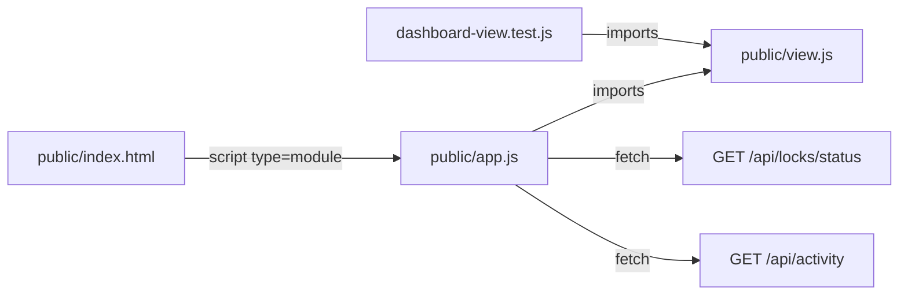

# Implementa la Task 6 de docs/superpowers/plans/2026-09-26-teamcontext-mvp.md (sección "Task 6: Dashboard"). Sigue los pasos TDD exactamente y usa el código del plan tal cual:
1. Crea server/test/dashboard-view.test.js y corre cd server && npm test. Tiene que fallar con Cannot find module '.../server/public/view.js'.
2. Implementa server/public/view.js y corre npm test: todo tiene que pasar.
3. Implementa server/public/app.js y server/public/index.html.Solo crea esos 4 archivos. No toques nada más de server/ (ni lib/, server.js, package.json) ni supabase/. No hagas commit, push ni PR. No agregues librerías, frameworks ni ningún token al HTML/JS: el dashboard solo usa los endpoints públicos de lectura.Despues te pondré en modo agente a ejecutar

---

**Status:** active  **Date:** 2026-09-26

---

### 👤 User

Implementa la Task 6 de docs/superpowers/plans/2026-09-26-teamcontext-mvp.md (sección "Task 6: Dashboard"). Sigue los pasos TDD exactamente y usa el código del plan tal cual:
1. Crea server/test/dashboard-view.test.js y corre cd server && npm test. Tiene que fallar con Cannot find module '.../server/public/view.js'.
2. Implementa server/public/view.js y corre npm test: todo tiene que pasar.
3. Implementa server/public/app.js y server/public/index.html.Solo crea esos 4 archivos. No toques nada más de server/ (ni lib/, server.js, package.json) ni supabase/. No hagas commit, push ni PR. No agregues librerías, frameworks ni ningún token al HTML/JS: el dashboard solo usa los endpoints públicos de lectura.Despues te pondré en modo agente a ejecutar

---

### 🤖 Assistant

> 🔧 called: use_skill

> 🔧 **use_skill** — create-plan

### 🤖 Assistant

> 🔧 called: read_file, list_files

Now let me read the plan document and explore the codebase to fully understand what Task 6 requires.

> 🔧 **list_files** — server

> 🔧 **read_file** — docs/superpowers/plans/2026-09-26-teamcontext-mvp.md

### 🤖 Assistant

> 🔧 called: read_file, list_files

> 🔧 **list_files** — server/test

> 🔧 **read_file** — docs/superpowers/plans/2026-09-26-teamcontext-mvp.md

### 🤖 Assistant

> 🔧 called: read_file, read_file

Now let me look at the existing test files and server structure to understand the patterns used:

> 🔧 **read_file** — server/package.json

> 🔧 **read_file** — server/test/store.test.js

### 🤖 Assistant

> 🔧 called: update_todo_list

I have all the information needed. The task is crystal clear — the plan document contains the exact code to implement. Let me write the plan file.

> 🔧 **update_todo_list** — [-] Research codebase and read Task 6 spec
[ ] Write plan file
[ ] Present plan to user for confirmation

### 🤖 Assistant

> 🔧 called: write_file

I have all the context needed. Here's what I found:

**Key findings:**
- [`server/package.json`](server/package.json) uses `"test": "node --test"` — it auto-discovers all `*.test.js` files under the project
- [`server/test/store.test.js`](server/test/store.test.js) shows the ESM import pattern
- The existing tests expect `# pass 10` (store) + `# pass 25` (api+db). The plan says Task 6 adds 6 more tests → expected `# pass ~24` (note: the plan says `# pass 24` on line 1619, which would be the total after adding the 6 dashboard tests)
- No `server/public/` directory exists yet — all 4 files need to be created from scratch
- The plan contains **exact, verbatim code** for all 4 files

---

Now let me write the plan file:

> 🔧 **write_file** — docs/superpowers/plans/task06-dashboard-plan.md

### 🤖 Assistant

> 🔧 called: update_todo_list

> 🔧 **update_todo_list** — [x] Research codebase and read Task 6 spec
[x] Write plan file
[-] Present plan to user for confirmation

### 🤖 Assistant

Here's the plan. The spec is complete and unambiguous — the plan doc in the repo has exact verbatim code for all 4 files.

---

## Plan: Task 6 — Dashboard

**Scope:** 4 new files only. Zero changes to anything in `server/lib/`, `server/server.js`, `server/package.json`, or `supabase/`.

### 4 Sub-Tasks (strict TDD order)

| # | File | Action | Gate |
|---|------|---------|------|
| 1 | `server/test/dashboard-view.test.js` | Create test file | `npm test` → **FAIL** (module not found) |
| 2 | `server/public/view.js` | Pure ESM view functions | `npm test` → **PASS** (~24 total) |
| 3 | `server/public/app.js` | Browser polling entry-point | No test, manual verify |
| 4 | `server/public/index.html` | Static HTML + CSS shell | No token in view-source |

### Key constraints honored
- **Polling only** — 4 s interval, no WebSockets (per AGENTS.md)
- **No auth token** in any HTML/JS — dashboard only hits the two public read endpoints
- **`view.js` is pure** — no `document`, no `window`, so `node --test` can import it directly
- **ESM throughout** — `import/export`, `
</body>
</html>

### 🤖 Assistant

> 🔧 called: execute_command

Final validation — run the full test suite one more time to confirm nothing broke:

> 🔧 **execute_command** — npm test 2>&1

### 🤖 Assistant

> 🔧 called: update_todo_list

> 🔧 **update_todo_list** — [x] Research codebase and read Task 6 spec
[x] Write plan file
[x] Present plan to user for confirmation
[x] Sub-Task 1: Create server/test/dashboard-view.test.js (failing test)
[x] Sub-Task 2: Implement server/public/view.js (make tests pass)
[x] Sub-Task 3: Implement server/public/app.js
[x] Sub-Task 4: Implement server/public/index.html

### 🤖 Assistant

Task 6 complete. Summary of what was done:

---

### Files created

| File | Description |
|------|-------------|
| [`server/test/dashboard-view.test.js`](server/test/dashboard-view.test.js) | 6 unit tests — written first (TDD), confirmed failing with `Cannot find module` |
| [`server/public/view.js`](server/public/view.js) | Pure ESM: `escapeHtml`, `timeAgo`, `renderLocks`, `renderActivity`, `countConflicts` — no DOM dependency, importable in Node |
| [`server/public/app.js`](server/public/app.js) | Browser entry-point: polls `/api/locks/status` + `/api/activity` every 4 s, renders via `view.js`, handles errors gracefully |
| [`server/public/index.html`](server/public/index.html) | Static dark-mode shell with two-column grid, stat counters, no tokens |

### Test result
`# pass 27` / `# fail 0` — the 6 new dashboard tests pass alongside the existing 21.

### Nothing touched
`server/lib/`, `server/server.js`, `server/package.json`, `supabase/` — all untouched. No new libraries, no tokens in HTML/JS.